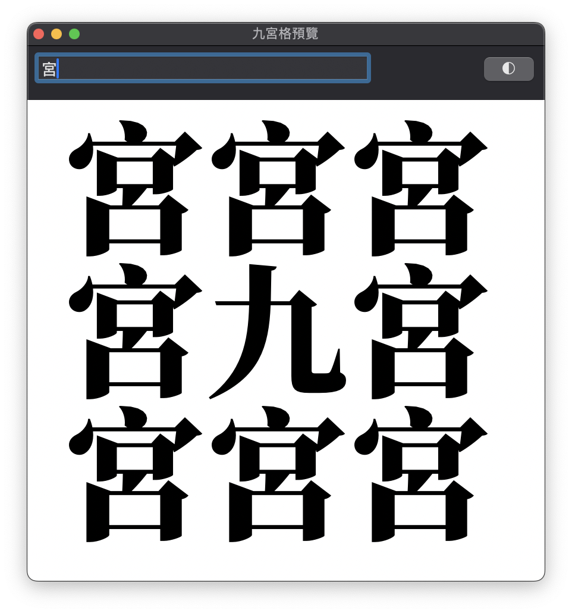
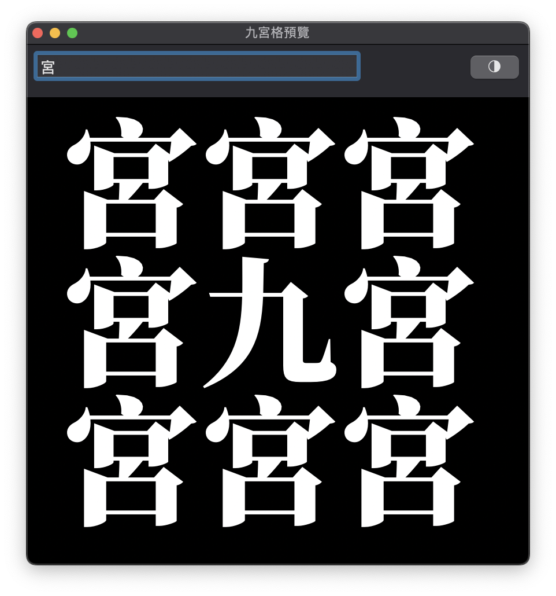
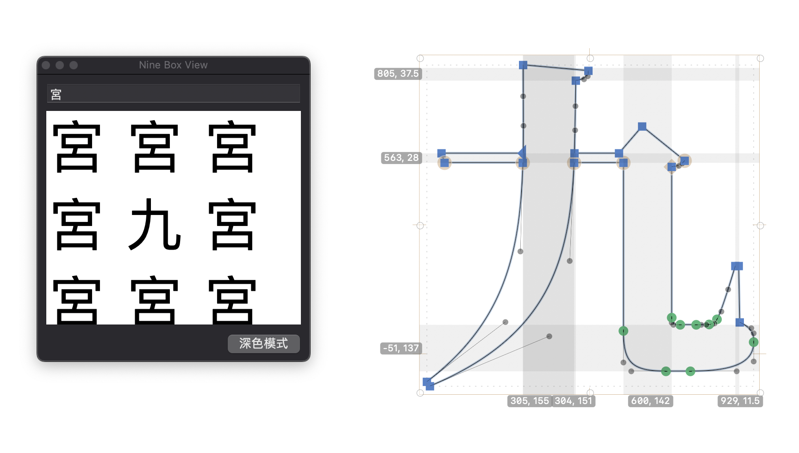
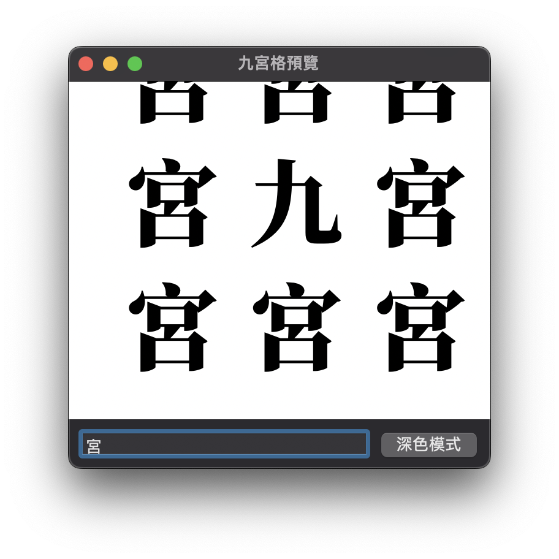
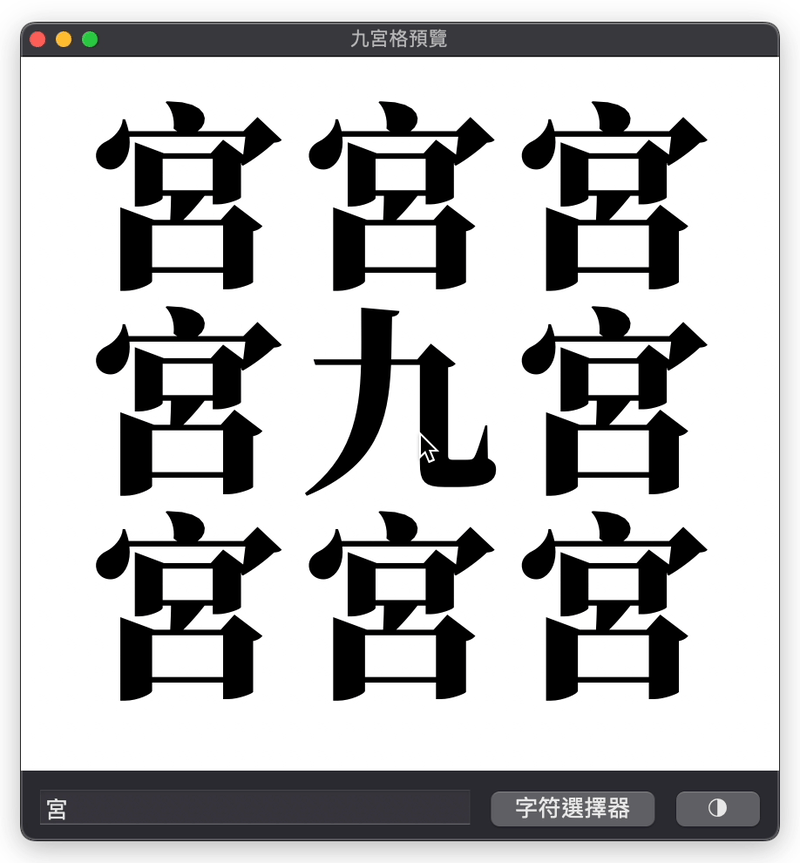
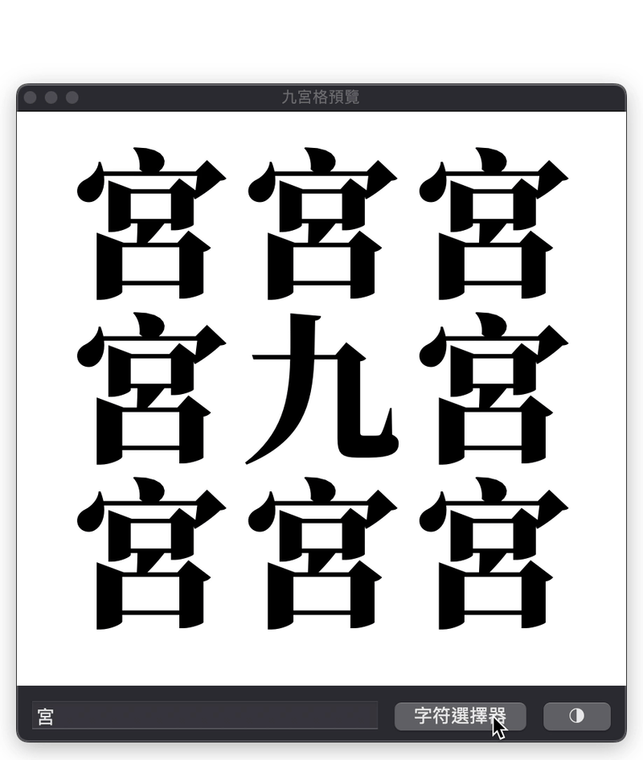

去年，我懷著忐忑又興奮的心情，開始了自學開發 Glyphs 外掛的冒險。那時候，AI 助手還不像現在這麼方便，我只能像個偵探一樣，四處搜尋線索，東拼西湊。經過無數個夜晚的奮戰，我終於成功製作並上架了我的第一個作品。回想起來，那種成就感讓我至今難忘。不過，我也不得不在專案的「已知問題」段落中老實承認：

> 此外掛還有一些問題尚待解決，短期內不會修正它們。

說實話，寫下這段話時，我心裡有點沮喪，卻又無可奈何。

轉眼間，一年過去了。看著對話型 AI 的迅速發展，我忍不住要說：這一定會帶來很多令人期待的改變！雖然我們還不能用腦波製作字型（衷心希望有一天能實現），但技術進展之快已經讓我非常驚艷。於是，帶著一股衝勁，我決定和 Claude AI 合作，重新打造我的外掛。這次的成果老實說，我有點得意。

## 從截圖到程式碼：重塑外掛介面的奇妙歷程

回顧第一版程式碼，我忍不住苦笑。簡直就是一盤散沙！所以這次我決定換個方式。我丟了兩張第一版截圖向 AI 展示：

|  |  |
|:--:|:--:|
| 第一版白底 | 第一版黑底 |

這招是我在其他專案中學到的小訣竅——Claude 解讀介面截圖的能力相當好。我對它說：「來吧，猜猜我想做什麼？」

> 我：
>
> 我要寫一個外掛，工具介面長這樣，請幫我還原。如果有需要我說明的部分請先提出，等待資訊足夠確認後再開始撰寫程式碼。
>
> [展示圖片*2]
>
> ---
>
> Claude：
>
> 非常感謝您提供的資訊和介面截圖。我來嘗試描述這個外掛的基本構造和功能:
>
> 1. 這似乎是一個名為"九宮格預覽"的字型設計工具外掛。
> 2. 介面主要包含以下元素:
>     - 頂部有一個搜尋/輸入欄位，目前顯示"東"字
>     - 右上角有一個切換按鈕(可能是深色/淺色模式切換)
>     - 中央區域是一個3x3的格子,顯示9個漢字
> 3. 主要功能看起來是根據輸入的漢字,在九宮格中顯示相關的字型變體或相似字。
> 4. 介面支援深色和淺色兩種模式。
>
> 在開始編寫程式碼之前,我有幾個問題需要確認:
>
> 1. 這個外掛是為哪種字型設計軟體開發的?是Glyphs嗎?
> 2. 九宮格中的字是如何選擇的?是根據相似度、筆劃數或其他規則?
> 3. 搜尋欄是否支援輸入多個字元?
> 4. 右上角的切換按鈕除了切換深淺模式,是否還有其他功能?
> 5. 您希望使用哪種程式語言來開發這個外掛?
>
> 有了這些資訊,我就能更準確地為您提供程式碼和實現建議。請提供更多細節,我會根據您的回答調整方案。
>
> …

經過一番熱烈討論和你來我往的猜測，我們終於達成共識。接著，Claude 為我勾勒出一個簡潔的介面架構雛形。看著螢幕上的設計，我不禁會心一笑。



經過一段時間的雕琢，初版介面總算大功告成。不過，細心的我發現預覽畫面中的字型還是內建的，而非編輯中的字體。

為了解決這個小麻煩，我靈機一動，把第一版參考的 [RotateView](https://github.com/aaronbell/RotateView) 外掛程式碼拿來給 Claude 參考。經過幾輪討論（有時甚至變成了頭腦風暴），我們順利地把這個功能整合進來。看著成果，我不禁暗自慶幸：還好有 AI 幫忙，不然我可能又要熬好幾個通宵了。



## 九宮格排版：依舊是最棘手的挑戰

說到排版，我就忍不住嘆氣。無論是第一版還是第二版，這都是最令我頭疼的部分。這次我仍然在這上面費盡心思。不過，有了 AI 助手，感覺就像有了一個永不疲倦的討論夥伴，讓我不再是孤軍奮戰。這次，我們攻克了第一版所有的魔王問題：

1. 字體隨視窗縮放：第一版只能維持固定字體大小，在高解析度螢幕上簡直慘不忍睹（字體小得像螞蟻，根本看不清細節）。
2. 字寬不一時的置中對齊：前一版只能靠左對齊，這在製作不等寬字體時簡直是場噩夢。當時我只能無奈地擱置這個問題，因為技術能力不足，而且說實話，我也沒那麼迫切需要。

在這次改版中，我和 Claude 像是進行了一場智力馬拉松。我們不斷溝通，反覆鑽研程式碼，終於在某個深夜，我看著螢幕上的結果，忍不住歡呼：「成功了！」不僅如此，程式碼變得更加清晰精簡，這讓我有種莫名的成就感。

更讓我興奮的是，我們還加入了一些以前想都不敢想的新功能——比如**畫面縮放**和**雙擊重置大小**。每次使用這些新功能，我都忍不住露出得意的笑容。（暫時移除）



## 驚喜：整合最新版字符選擇器

正當我們埋頭苦幹時，Glyphs 3.2 推出了更新。一推出我就迫不及待進行測試，發現新功能—字符選擇器對漢字部件搜尋特別友善。二話不說，我立刻把相關文件和程式碼丟給了 AI：

> 我：
>
> 參考背景知識庫的`glyphs-3-2-released-coding`裡面提到新增了一個新的搜索欄功能，讓使用者更好的搜索到需要的字符，我希望將我的搜索欄加入類似的功能。請說明如何加入，之後開始撰寫程式碼。
>
> ---
>
> Claude：
>
> 根據 Glyphs 3.2 中新增的搜索欄功能,我們可以對你的九宮格預覽插件做以下改進:
>
> 1. 使用 `PickGlyphs()` 函數來實現更強大的字符搜索功能
> 2. 添加一個按鈕來觸發搜索對話框
> 3. 保存搜索歷史,以便下次使用
>
> 以下是具體的實現步驟:
> …

令我驚訝的是，Claude 幾乎是一揮手的功夫就把新功能整合到我的工具中。我不禁感嘆：這個效率比我泡一碗泡麵還快！



結合第一版就有的搜尋欄，現在使用者不僅能快速參考一般漢字，還能輕鬆搜尋作為部件或異體字使用的特殊字符。

## 挑戰全語系：一場驚心動魄的翻譯冒險

說到第一版的翻譯，我就忍不住搖頭苦笑。那時候還是 Google 翻譯稱霸的年代，我只能勉強翻譯了英文和東亞語系的標題，還得花上好幾個小時手動確認譯名。這次，我決定要來個大躍進。憑藉 Claude 出色的翻譯能力，我大膽挑戰了全語系支援。過程中有個譯名小插曲：

> 我：
>
> ```python
> 'zh-Hant': u'九宮格預覽',
> 'zh-Hans': u'九宫格预览',
> 'ja': u'九マス表示',
> 'ko': u'구궁도 보기',
> ```
>
> ```python
> 'zh-Hant': u'九宮格預覽',
> 'zh-Hans': u'九宫格预览',
> 'ja': u'九宮格プレビュー',
> 'ko': u'구궁격 미리보기'
> ```
>
> 哪一個翻譯品質較好？相同語言的不同翻譯之間的優劣比較。
>
> ---
>
> ChatGPT：
>
> 比較相同語言的不同翻譯：
>
> 1. **繁體中文（zh-Hant）**：
>     - **九宮格預覽**：這是標準的翻譯，使用「預覽」來表示「Preview」。
>     - **九宮格預覽**（相同，無需比較）。
> 2. **簡體中文（zh-Hans）**：
>     - **九宫格预览**：這與繁體中文相同，僅字形不同。
>     - **九宫格预览**（相同，無需比較）。
> 3. **日文（ja）**：
>     - **九マス表示**：直譯「九宮格顯示」，更偏向於「顯示」或「視圖」的意思。
>     - **九宮格プレビュー**：使用了「プレビュー」這個外來語音譯，明確地表達「預覽」的意思。
>
>     **比較**：**九宮格プレビュー**的翻譯更為準確和自然，因為它直接表達了「預覽」的意思，而不是單純的「顯示」。
>
> 4. **韓文（ko）**：
>     - **구궁도 보기**：直譯為「九宮格顯示」，偏向於「顯示」的意思。
>     - **구궁격 미리보기**：使用了「미리보기」，明確表示「預覽」的意思。
>     
>     **比較**：**구궁격 미리보기**的翻譯更為準確和自然，因為它直接表達了「預覽」的意思，而不是單純的「顯示」。
>     
> 
> **總結**：在日文和韓文中，「九宮格プレビュー」和「구궁격 미리보기」比「九マス表示」和「구궁도 보기」的翻譯品質更好，因為它們更準確地反映了「預覽」的意思。

> 我：
>
> 1. **日文（ja）**： • **九マス表示**：直譯「九宮格顯示」，更偏向於「顯示」或「視圖」的意思。 • **九宮格プレビュー**：使用了「プレビュー」這個外來語音譯，明確地表達「預覽」的意思。 **比較**：**九宮格プレビュー**的翻譯更為準確和自然，因為它直接表達了「預覽」的意思，而不是單純的「顯示」。
> 2. **韓文（ko）**： • **구궁도 보기**：直譯為「九宮格顯示」，偏向於「顯示」的意思。 • **구궁격 미리보기**：使用了「미리보기」，明確表示「預覽」的意思。 **比較**：**구궁격 미리보기**的翻譯更為準確和自然，因為它直接表達了「預覽」的意思，而不是單純的「顯示」。
> 
> 你同意這個說法嗎？或是你有其他觀點，不要被我的提問影響，說出自己的建議。
> 
> ---
> 
> Claude：
> 
> 我同意您的觀點，並認為您的分析非常準確。讓我進一步闡述：
> 
> 1. 日文（ja）： 確實，「九宮格プレビュー」（Kyūgōshiki purebiyū）比「九マス表示」（Kyūmasu hyōji）更準確地表達了"Nine Box Preview"的意思。「プレビュー」（purebiyū）是「preview」的音譯，在現代日語中廣泛使用，特別是在軟體和數位環境中。它明確傳達了「預覽」的概念，而不僅僅是「顯示」。
> 2. 韓文（ko）： 同樣，「구궁격 미리보기」（Gugungyeok miribogi）比「구궁도 보기」（Gugungdo bogi）更準確。「미리보기」（miribogi）直接翻譯為「預覽」，在韓語軟體術語中常用於表示preview功能。這個翻譯不僅準確表達了功能，也符合韓語使用者的習慣。
> 
> 其他觀點：
> 
> 1. 本地化的重要性：選擇「プレビュー」和「미리보기」這樣的術語不僅準確，也體現了對目標語言使用習慣的尊重。在軟體本地化中，使用目標語言使用者熟悉的術語可以大大提高用戶體驗。
> 2. 一致性：如果Glyphs軟體在其他功能中已經使用了「プレビュー」和「미리보기」來表示"preview"，那麼在這裡使用相同的詞彙可以保持整個軟體介面的一致性。
> 3. 文化適應：「九宮格」這個概念在東亞文化中有深厚的歷史背景。選擇「九宮格プレビュー」和「구궁격 미리보기」既保留了文化元素，又融入了現代軟體術語，是文化適應的良好範例。
> 4. 字符數考慮：在設計UI時，需要考慮不同語言翻譯的長度。日文和韓文的這兩個選項在長度上都較為緊湊，有利於保持UI的整潔和一致性。
> 
> 總的來說，我完全同意您的分析。「九宮格プレビュー」和「구궁격 미리보기」不僅更準確地傳達了功能的本質，也更符合各自語言的使用習慣和軟體本地化的最佳實踐。

雖然我事先貼心地提供了 Glyphs 所有語系的介面詞彙表，但「九宮格預覽」的翻譯還是與我的想像有些出入。為了追求完美，我甚至動用了 ChatGPT 和 Claude 進行交叉比對，就像是在進行一場翻譯偵探遊戲。最後，我要求 Claude 根據這個邏輯重新調整所有用詞。希望最終的翻譯結果，可以讓所有使用不同介面語言的使用者都能好好享受這個外掛。

```python
self.name = Glyphs.localize({
    'en': u'Nine Box Preview',
    'zh-Hant': u'九宮格預覽',
    'zh-Hans': u'九宫格预览',
    'ja': u'九宮格プレビュー',
    'ko': u'구궁격 미리보기',
    'ar': u'معاينة المربعات التسعة',
    'cs': u'Náhled devíti polí',
    'de': u'Neun-Felder-Vorschau',
    'es': u'Vista previa de nueve cuadros',
    'fr': u'Aperçu en neuf cases',
    'it': u'Anteprima a nove caselle',
    'pt': u'Visualização em nove caixas',
    'ru': u'Предпросмотр девяти ячеек',
    'tr': u'Dokuz Kutu Önizleme'
})
```

## AI 時代的必備技能：我的小領悟

最近幾次和AI合作的過程中，我彷彿經歷了一場頭腦革命。我逐漸意識到，清晰的邏輯表達和精確的指令溝通，就像是與 AI 對話的密碼。掌握了這個「密碼」，AI 就能更精準地協助我解決問題。

此外，在我們這個特殊的工作領域（專業的字型設計世界），如何靈活運用程式碼獲取大量參考資訊，並將其整理成恰當的格式，已經成為一項不可或缺的技能。每次成功運用這項技能，我都有種駕馭科技的成就感。

這次的經歷不僅讓我的外掛功能更加完善，更讓我深刻體會到 AI 輔助開發的無限可能。期待在未來的專案中，能夠更好地運用這些新技能，創造出更多讓人眼前一亮的作品。也許下一個突破性的工具就在眼前了。

## 🔌 作品展示


如果你也對這個九宮格預覽外掛感興趣，歡迎試試看：
- 想深入了解更多細節？這邊是 [GitHub 專案頁面](https://github.com/yintzuyuan/NineBoxView)，裡面有完整的說明。
- 已經在用 Glyphs 了？
複製這串文字到瀏覽器就能直接安裝：`glyphsapp3://showplugin/九宮格預覽`

用過之後有什麼想法都歡迎告訴我。覺得還不錯的話，在 GitHub 上給一顆⭐️的話我會很開心的！
